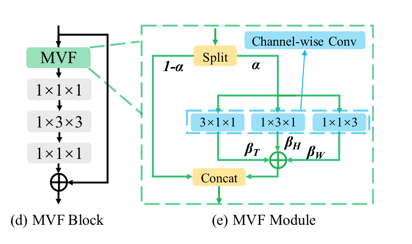

# 基于Paddle复现《MVFNet: Multi-View Fusion Network for Efficient Video Recognition》
## 1.简介
在这篇论文中，作者提出了从多视点对HxWxT的视频信号进行建模，引入了一个高效的时空模块，称为多视点融合模块MVF。MVF是一个即插即用的模块，可以将现有的
2D CNN模型转换为一个功能强大的时空特征提取器，并且开销很小。



在上图中，在一个标准的ResNet的block中集成了MVF模块。在MVF模块中，输入的特征图被分为两个部分，一部分用于用于原始的激活函数计算。另一部分，用于多视图时空建模
，在MVF模块中，多视图建模分别通过时间、水平和垂直维度的卷积来执行。然后将这个三个卷积的输出的特征图按元素相加，最后两部分的特征图连接在一起来融合原始的激活函数输出和
多视图模块的激活函数输出。

## 2.复现精度
在UCF-101数据的测试效果如下表。

| NetWork | epochs | opt | image_size | batch_size | dataset | split | mean class accuracy |
| --- | --- | --- | --- | --- | --- | --- | --- |
| MVF | 100 | SGD | 224x224 | 16 | UCF-101 | 1 | 96.32 |
| MVF | 100 | SGD | 224x224 | 16 | UCF-101 | 2 | 96.65 |
| MVF | 100 | SGD | 224x224 | 16 | UCF-101 | 3 | 95.43 |

最终在UCF101三种不同的标注下的平均mean class accuracy是96.13，与原文中的96.66有一点差距。经过多次试验均有一定差距，所以对本次复现的模型进行了
精度对齐。对齐说明在[精度对齐说明文档](https://github.com/txyugood/PaddleMVF/blob/main/alignment/README.md)。验证结果证明模型复现正确，分析原因可能是因为训练策略或随机因素造成的，官方repo中并没有基于UCF101数据集训练的
代码与参数。使用论文中提到的超参数，是结果也与论文中的指标有所差距。

## 3.数据集
UCF-101:

第一部分：[https://aistudio.baidu.com/aistudio/datasetdetail/118203](https://aistudio.baidu.com/aistudio/datasetdetail/118203)

第二部分：[https://aistudio.baidu.com/aistudio/datasetdetail/118316](https://aistudio.baidu.com/aistudio/datasetdetail/118316)

预训练模型：

链接: https://pan.baidu.com/s/10dZTZwKEJ83smSJZ7mtp-w 

提取码: rjc8


## 4.环境依赖
PaddlePaddle == 2.2.0
## 5.快速开始

### 模型训练

分别使用三种不同的训练集标注进行训练：
```shell
cd paddle-mvf
nohup python -u train.py --dataset_root ../ucf101  --pretrained ../paddle_mvf.pdparams --batch_size 16 --split 1 > train_1.log &
tail -f train_1.log

nohup python -u train.py --dataset_root ../ucf101  --pretrained ../paddle_mvf.pdparams --batch_size 16 --split 2 > train_2.log &
tail -f train_2.log

nohup python -u train.py --dataset_root ../ucf101  --pretrained ../paddle_mvf.pdparams --batch_size 16 --split 3 > train_3.log &
tail -f train_3.log
```
dataset_root: 训练集路径

pretrained: 预训练模型路径

batch_size: 训练数据的批次容量

split: 指定的训练集标注文件，共有3个，可取值1，2，3.

### 模型评估

使用最优模型进行评估.

最优模型下载地址：

链接: https://pan.baidu.com/s/1RNOA2G_YCKgDFVm1nf31Gw 

提取码: f42e

```shell
python test.py --dataset_root ../ucf101 --pretrained ../best_model_split_1.pdparams --spilt 1
```

dataset_root: 训练集路径

pretrained: 预训练模型路径

分别使用三种不同的数据集标注进行评估。
评估结果1

```shell
[>>>>>>>>>>>>>>>>>>>>>>>>>>>>>>>>>>>>>>>>>>>>>>>>>>] 3783/3783, 0.6 task/s, elapsed: 5857s, ETA:     0s
Evaluating top_k_accuracy ...

top1_acc	0.9635
top5_acc	0.9952

Evaluating mean_class_accuracy ...

mean_acc	0.9632
top1_acc: 0.9635
top5_acc: 0.9952
mean_class_accuracy: 0.9632
```

评估结果2
```shell
python test.py --dataset_root ../ucf101 --pretrained ../best_model_split_2.pdparams --spilt 2
```

```shell
[>>>>>>>>>>>>>>>>>>>>>>>>>>>>>>>>>>>>>>>>>>>>>>>>>>] 3734/3734, 0.6 task/s, elapsed: 5817s, ETA:     0s
Evaluating top_k_accuracy ...

top1_acc	0.9657
top5_acc	0.9976

Evaluating mean_class_accuracy ...

mean_acc	0.9665
top1_acc: 0.9657
top5_acc: 0.9976
mean_class_accuracy: 0.9665
```

评估结果3

```shell
python test.py --dataset_root ../ucf101 --pretrained ../best_model_split_3.pdparams --spilt 3
```

```shell
[>>>>>>>>>>>>>>>>>>>>>>>>>>>>>>>>>>>>>>>>>>>>>>>>>>] 3696/3696, 0.6 task/s, elapsed: 6126s, ETA:     0s
Evaluating top_k_accuracy ...

top1_acc	0.9545
top5_acc	0.9984

Evaluating mean_class_accuracy ...

mean_acc	0.9543
top1_acc: 0.9545
top5_acc: 0.9984
mean_class_accuracy: 0.9543
```

### 模型推理

使用predict.py 脚本可进行单个视频文件的推理预测，可直接使用rawframes格式的数据做测试。

执行以下脚本,

```shell
python predict.py --video ../ucf101/rawframes/Billiards/v_Billiards_g17_c01 --pretrained ../best_model_split_1.pdparams

Loading pretrained model from ../best_model_split_1.pdparams
There are 330/330 variables loaded into Recognizer2D.
Top1 class:11
```


### TIPC基础链条测试

该部分依赖auto_log，需要进行安装，安装方式如下：

auto_log的详细介绍参考[https://github.com/LDOUBLEV/AutoLog](https://github.com/LDOUBLEV/AutoLog)。

```shell
git clone https://github.com/LDOUBLEV/AutoLog
pip3 install -r requirements.txt
python3 setup.py bdist_wheel
pip3 install ./dist/auto_log-1.0.0-py3-none-any.whl
```


```shell
bash test_tipc/prepare.sh test_tipc/configs/mvf/train_infer_python.txt 'lite_train_lite_infer'

bash test_tipc/test_train_inference_python.sh test_tipc/configs/mvf/train_infer_python.txt 'lite_trai
n_lite_infer'
```

测试结果如截图所示：


## 6.代码结构与详细说明
```shell
├── README.md
├── logs # 训练以及评测日志
├── alignment
│  ├── README.md # 精度对齐说明文档
│  ├── step1 # 模型结构对齐检测脚本
│   ├── step2 # 评测指标对齐检测脚本
│   ├── step3 # 损失函数对齐检测脚本
│   ├── step4 # 反向对齐检测脚本
│   └── torch # torch模型核心代码
├── datasets # 数据集包
│   ├── __init__.py
│   ├── base.py #数据集基类
│   ├── file_client.py # 文件处理类
│   ├── pipelines
│   │   └── transforms.py # 数据增强类
│   ├── rawframe_dataset.py # 数据集类
│   └── utils.py #数据集工具类
├── models
│   ├── __init__.py
│   ├── base.py # 模型基类
│   ├── resnet.py # 标注resnet模型
│   ├── heads # 模型头部实现
│   └── recognizers # 识别模型框架
├── progress_bar.py #进度条工具
├── test.py # 评估程序
├── test_tipc # TIPC脚本
│   ├── README.md
│   ├── common_func.sh # 通用脚本程序
│   ├── configs
│   │   └── mvf
│   │       └── train_infer_python.txt # 单机单卡配置
│   ├── data
│   │   ├── example.npy # 推理用样例数据
│   │   └── mini_ucf.zip # 训练用小规模数据集
│   ├── output
│   ├── prepare.sh # 数据准备脚本
│   └── test_train_inference_python.sh # 训练推理测试脚本
├── timer.py # 时间工具类
├── train.py # 训练脚本
├── predict.py # 预测脚本
└── utils.py # 训练工具包
```

## 7.模型信息

| 信息 | 描述 |
| --- | --- |
|模型名称| MVF |
|框架版本| PaddlePaddle==2.2.0|
|应用场景| 动作识别 |
